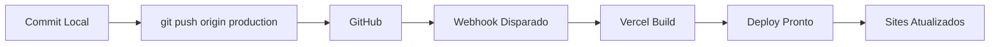

# 📚 Documentação Completa - Vercel SDK & Deploy System

## 🎯 Visão Geral

Este projeto está integrado com o Vercel SDK para monitoramento, diagnóstico e gerenciamento de deploys diretamente do ambiente de desenvolvimento.

## ✅ Status da Configuração

### 1. Vercel SDK
- **Status**: ✅ Funcionando
- **Arquivo**: `scripts/vercel-integration.ts`
- **Dependência**: `@vercel/sdk` instalada
- **Último teste**: 03/08/2025 - Deploy ID: dpl_8R8QvBbBWES2jZwTYzgnppg7fxpn

### 2. Deploy Hook
- **Status**: ✅ Configurado e testado
- **URL**: Armazenada em `.vercel-webhook`
- **Branch**: `production`
- **Método**: Webhook POST direto

### 3. Comandos Disponíveis

```bash
# Verificar status do último deploy
npm run vercel:status

# Listar 10 deploys recentes
npm run vercel:list

# Ver logs do último deploy
npm run vercel:logs

# Diagnosticar problemas de deploy
npm run vercel:diagnose

# Instruções para redeploy manual
npm run vercel:redeploy

# Ver ajuda
npm run vercel:help
```

## 🚀 Como Fazer Deploy

### Método 1: Script Automatizado (Recomendado)
```bash
./deploy-production.sh
```

Este script:
1. Verifica se você está na branch `production`
2. Mostra o status do git
3. Pede confirmação
4. Faz push para GitHub
5. Dispara o webhook do Vercel
6. Mostra o Job ID
7. Aguarda 5 segundos e verifica o status

### Método 2: Deploy Manual
```bash
# 1. Push para GitHub
git push origin production

# 2. Disparar webhook
curl -X POST "$(grep WEBHOOK_URL .vercel-webhook | cut -d'=' -f2)"

# 3. Verificar status
npm run vercel:status
```

## 🔧 Configuração do SDK

### Arquivo: `.env.local`
```env
VERCEL_TOKEN=seu_token_aqui
VERCEL_PROJECT_ID=prj_JdNmOnGUK2lEOK69tMo0dpdFY2ry
VERCEL_TEAM_ID=team_1a2b3c4d5e6f7g8h9i0j1k2l
```

### Arquivo: `.vercel-webhook`
```env
WEBHOOK_URL=https://api.vercel.com/v1/integrations/deploy/prj_JdNmOnGUK2lEOK69tMo0dpdFY2ry/PgPyggDXP9
BRANCH=production
PROJECT_ID=prj_JdNmOnGUK2lEOK69tMo0dpdFY2ry
```

## 📊 Exemplos de Saída

### vercel:status
```
🔍 Checking deployment status...

📊 Latest Deployment Status:
━━━━━━━━━━━━━━━━━━━━━━━━━━━━
🆔 ID: dpl_8R8QvBbBWES2jZwTYzgnppg7fxpn
📅 Created: 8/3/2025, 11:18:06 PM
🌿 Branch: production
🎯 Target: production
📦 State: READY
🔗 URL: v5-rioporto.vercel.app
✅ Status: READY
━━━━━━━━━━━━━━━━━━━━━━━━━━━━
```

### vercel:diagnose
```
🏥 Diagnosing deployment issues...

🔍 Diagnostic Report:
━━━━━━━━━━━━━━━━━━━━━━━━━━━━

1️⃣ Deployment State Analysis:
   ✅ Deployment is ready

2️⃣ Build Configuration:
   Framework: Next.js (auto-detect)
   Branch: production
   Target: production

3️⃣ Common Issues Check:
   ✅ All checks passed
━━━━━━━━━━━━━━━━━━━━━━━━━━━━
```

## 🐛 Troubleshooting

### Deploy não está funcionando?

1. **Verifique o webhook:**
   ```bash
   cat .vercel-webhook
   ```

2. **Teste o webhook manualmente:**
   ```bash
   curl -X POST "$(grep WEBHOOK_URL .vercel-webhook | cut -d'=' -f2)"
   ```

3. **Verifique os logs:**
   ```bash
   npm run vercel:logs
   ```

4. **Execute diagnóstico:**
   ```bash
   npm run vercel:diagnose
   ```

### SDK não está funcionando?

1. **Verifique o token:**
   ```bash
   cat .env.local | grep VERCEL_TOKEN
   ```

2. **Gere novo token se necessário:**
   - Acesse: https://vercel.com/account/tokens
   - Crie um novo token
   - Atualize `.env.local`

## 🔄 Fluxo de Deploy Completo



## 📌 URLs Importantes

- **Dashboard**: https://vercel.com/dashboard
- **Projeto**: https://vercel.com/rioportos-projects/v5-rioporto
- **Tokens**: https://vercel.com/account/tokens
- **Domínios**:
  - https://rioporto.com.br
  - https://v1.rioporto.com.br
  - https://v2.rioporto.com.br
  - https://v3.rioporto.com.br
  - https://v4.rioporto.com.br
  - https://v5.rioporto.com.br

## 🛡️ Segurança

- ❌ NUNCA commite `.env.local`
- ❌ NUNCA commite `.vercel-webhook` (já está no .gitignore)
- ✅ Use variáveis de ambiente
- ✅ Tokens com escopo mínimo necessário

## 📅 Histórico de Configuração

- **03/08/2025**: Configuração inicial do webhook
- **03/08/2025**: Integração do Vercel SDK
- **03/08/2025**: Testes bem-sucedidos de deploy
- **03/08/2025**: Documentação criada

---

**Última atualização**: 03/08/2025 - 23:25 BRT
**Mantido por**: Claude Code & Johnny Helder